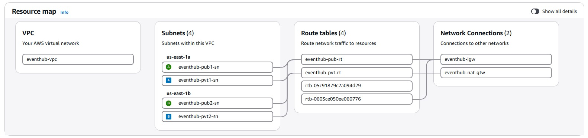
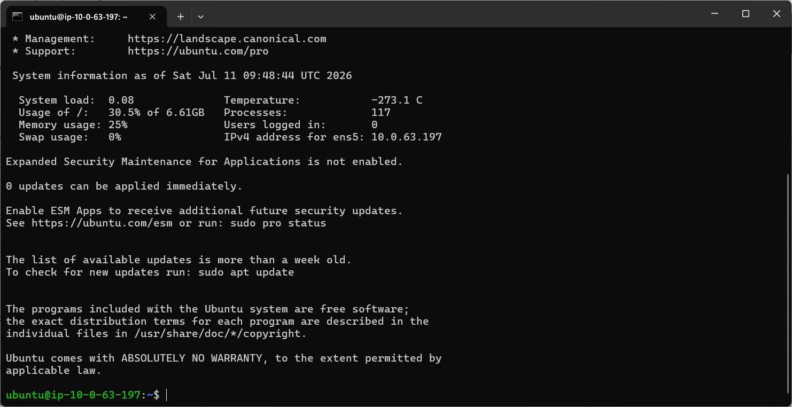
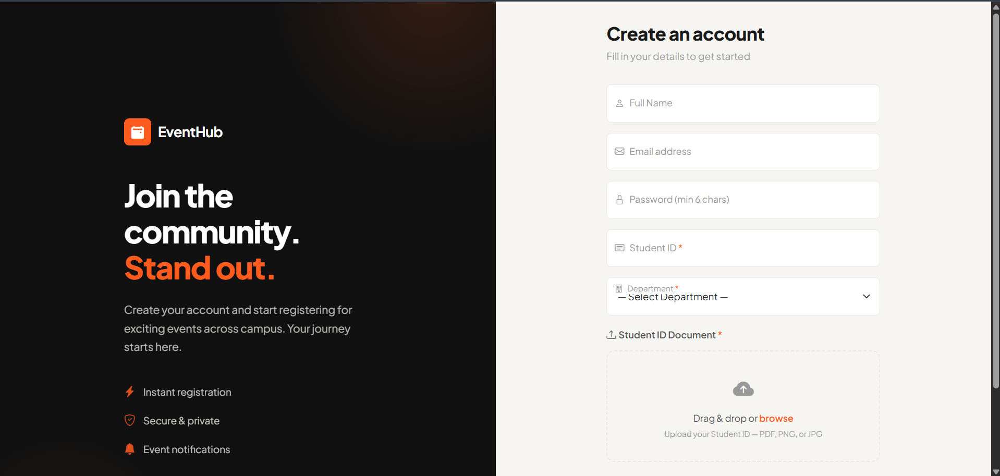
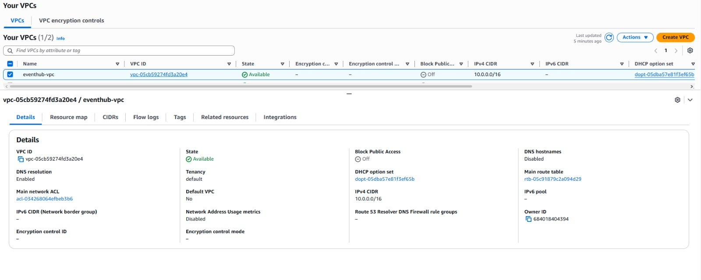
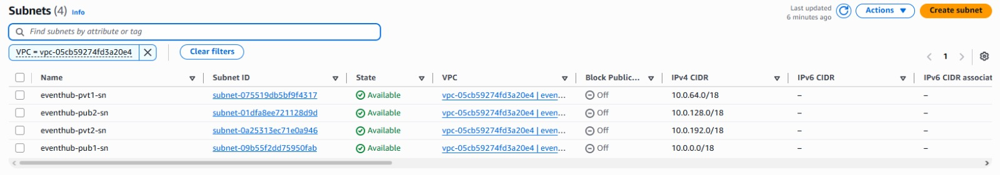
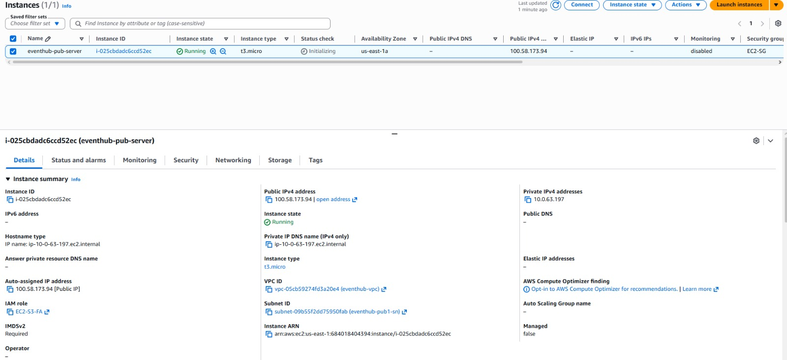
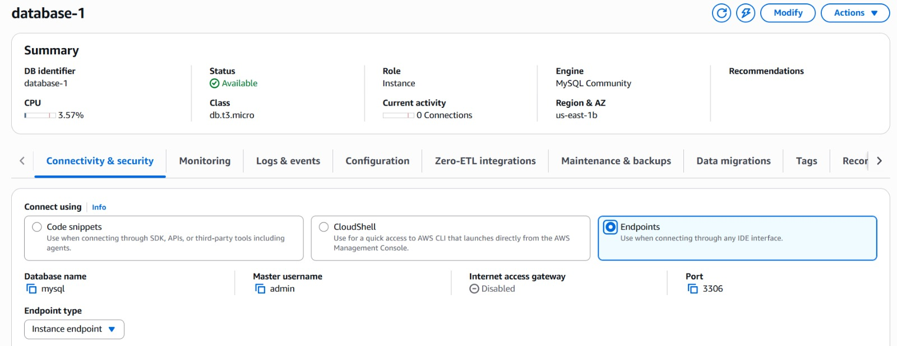
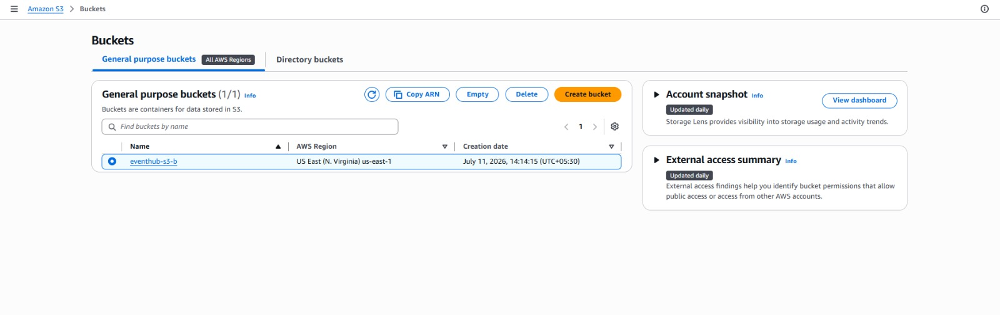
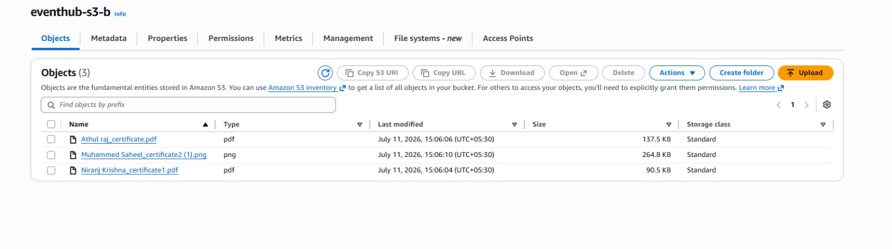
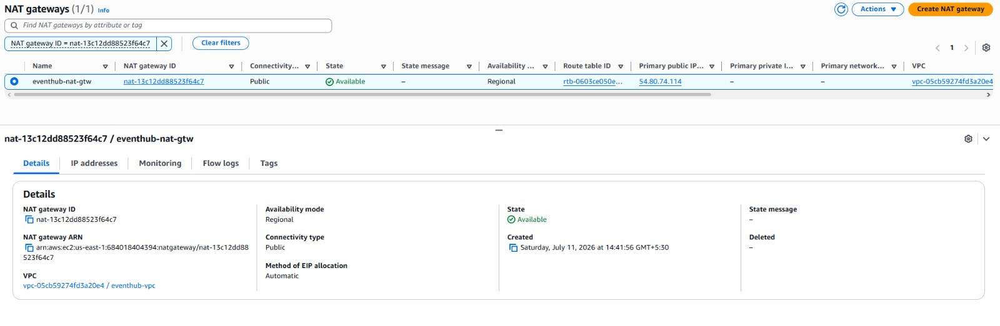

# EventHub - AWS Powered Student Event Registration System

## Features

### User Management
- Student registration and login
- Session-based authentication
- Department-wise user profiles
- Secure student ID verification

### Event Management
- Browse upcoming events
- Register for individual events
- Cancel registrations
- Dashboard showing registered events

### Intelligent Team Formation
- Team creation
- Live student search
- Invitation management
- Automatic invitation expiry
- Team capacity validation
- Automatic registration

# ☁️ AWS Cloud Architecture


## ☁️ AWS Services Used

| AWS Service | Purpose in the Project |
|-------------|------------------------|
| Amazon VPC | Created an isolated virtual network to securely host the EventHub application and AWS resources. |
| Public Subnets | Hosted internet-facing resources such as the Application Load Balancer and EC2 instances. |
| Private Subnets | Securely hosted the Amazon RDS database, preventing direct internet access. |
| Internet Gateway (IGW) | Enabled internet connectivity for resources deployed in the public subnets. |
| NAT Gateway | Allowed resources in private subnets to access the internet for updates without exposing them to inbound traffic. |
| Route Tables | Controlled network traffic between public/private subnets, the Internet Gateway, and the NAT Gateway. |
| Security Groups | Configured firewall rules to control inbound and outbound traffic for the EC2 instance, Application Load Balancer, and Amazon RDS. |
| Amazon EC2 | Hosted the Flask-based EventHub web application and handled client requests. |
| Amazon S3 | Stored uploaded student identity documents and application assets securely in the cloud. |
| Amazon RDS (MySQL) | Stored application data including users, events, registrations, invitations, and team information. |
| IAM | Managed user permissions, roles, and secure access to AWS resources and services. |
| Application Load Balancer (ALB) | Distributed incoming HTTP requests across the application instances to improve availability and reliability. |

## 🏗️ AWS Infrastructure

The EventHub application is deployed within a custom AWS Virtual Private Cloud (VPC), following a secure and scalable multi-tier architecture. The infrastructure consists of:

- Custom Amazon VPC
- Two Public Subnets
- Two Private Subnets
- Internet Gateway (IGW)
- NAT Gateway
- Application Load Balancer (ALB)
- Amazon EC2 Instance
- Amazon RDS (MySQL)
- Amazon S3 Bucket
- IAM Role
- Security Groups

---

## 🚀 Deployment Workflow

1. Created a custom Amazon VPC.
2. Configured:
   - Two Public Subnets
   - Two Private Subnets
3. Configured Route Tables and associated each subnet.
4. Attached an Internet Gateway (IGW) to the VPC.
5. Configured a NAT Gateway for outbound internet access from private subnets.
6. Created Security Groups for:
   - Application Load Balancer
   - EC2 Instance
   - Amazon RDS
7. Created an IAM Role allowing EC2 to securely access Amazon S3.
8. Created an Amazon S3 bucket for storing uploaded student identity documents.
9. Created an Amazon RDS MySQL database inside the private subnet.
10. Launched an EC2 instance.
11. Cloned the Flask application from GitHub onto the EC2 instance.
12. Configured the application with:
    - RDS Endpoint
    - Database Username
    - Database Password
    - S3 Bucket Name
13. Created an Application Load Balancer.
14. Created a Target Group.
15. Registered the EC2 instance with the Target Group.
16. Accessed the application using the Load Balancer DNS.

---

## 🔄 Application Request Flow

```text
                Student
                    │
                    ▼
      Application Load Balancer
                    │
                    ▼
              Amazon EC2
              (Flask App)
              ┌──────────────┐
              │              │
              ▼              ▼
       Amazon RDS        Amazon S3
      (MySQL Database) (Student Documents)
```

---

## 🗄️ Database Design

| Table | Description |
|--------|-------------|
| users | Stores student account information |
| events | Stores event details and metadata |
| registrations | Stores completed event registrations |
| teams | Stores team information for group events |
| team_members | Tracks invitation and team membership status |
| invite_cooldowns | Prevents invitation spam using cooldown timers |

---

## 👥 Team Registration Workflow

One of the key features of EventHub is its intelligent team formation system. The workflow includes:

- Team creation
- Live student search
- Invitation management
- Automatic invitation expiration (180 seconds)
- Invitation cooldown (120 seconds)
- Team capacity validation
- Atomic team confirmation
- Automatic registration of accepted members

This workflow prevents duplicate registrations, incomplete teams, and invitation spam while ensuring data consistency.

---

## 💻 Technology Stack

### Backend
- Python
- Flask

### Database
- Amazon RDS (MySQL)

### AWS Cloud Services
- Amazon EC2
- Amazon RDS
- Amazon S3
- Application Load Balancer
- Amazon VPC
- IAM
- Internet Gateway
- NAT Gateway
- Security Groups

### Libraries
- Flask
- boto3
- PyMySQL

---

# 📸 Project Screenshots

---

## ☁️ AWS Cloud Architecture

### AWS Architecture Diagram



Overall AWS architecture showing the VPC, public/private subnets, Internet Gateway, NAT Gateway, Route Tables, Application Load Balancer, EC2 instance, Amazon RDS, and Amazon S3.

---

### EC2 Terminal



SSH connection to the Ubuntu EC2 instance used to deploy and manage the EventHub application.

---

# 💻 Frontend

## 🔐 User Login


Students log in securely using their registered email and password.

---

## 📝 User Registration


New students create an account and upload their student ID for verification.

---

## 🏠 Dashboard


Dashboard displaying registered events, upcoming events, and account information.

---

## 📅 Browse Events


Students can browse available campus events and register with a single click.

---

## ➕ Create Event



Administrators can create and publish new student events.

---

## 📋 My Events


Displays all events registered by the logged-in student.

---

# ☁️ AWS Backend Infrastructure

## Amazon VPC



Custom VPC configured to securely isolate all AWS resources.

---

## Subnets



Public and private subnets distributed across multiple Availability Zones.

---

## Route Tables


Routing configuration for Internet Gateway and NAT Gateway connectivity.

---

## Security Groups


Firewall rules controlling inbound and outbound traffic for AWS resources.

---

## EC2 Instance



Ubuntu EC2 instance hosting the Flask EventHub application.

---

## Application Load Balancer


Application Load Balancer distributing incoming HTTP requests.

---

## Amazon RDS Database



Amazon RDS MySQL database storing application data securely inside the private subnet.

---

## Amazon S3 Bucket



Amazon S3 bucket used for storing uploaded student documents.

---

## S3 Objects



Uploaded files stored inside the S3 bucket.

---

## NAT Gateway



NAT Gateway enabling outbound internet connectivity for private subnet resources.
## 📂 Project Structure

```text
EventHub/
├── app.py
├── templates/
├── static/
├── requirements.txt
├── README.md
└── screenshots/
    ├── frontend/
    ├── backend/
    └── architecture/
```

---

## 🔮 Future Improvements

- Implement password hashing using bcrypt.
- Enable HTTPS using AWS Certificate Manager (ACM).
- Add Auto Scaling Groups for improved scalability.
- Deploy EC2 instances across multiple Availability Zones.
- Implement CI/CD using GitHub Actions.
- Containerize the application using Docker.
- Integrate Amazon CloudWatch for monitoring and logging.

---

## 👨‍💻 Author

**Vasudev A**  
AWS Cloud Computing Internship Project – ICT Academy & AWS Academy
