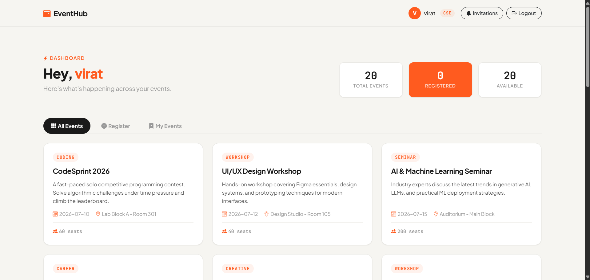
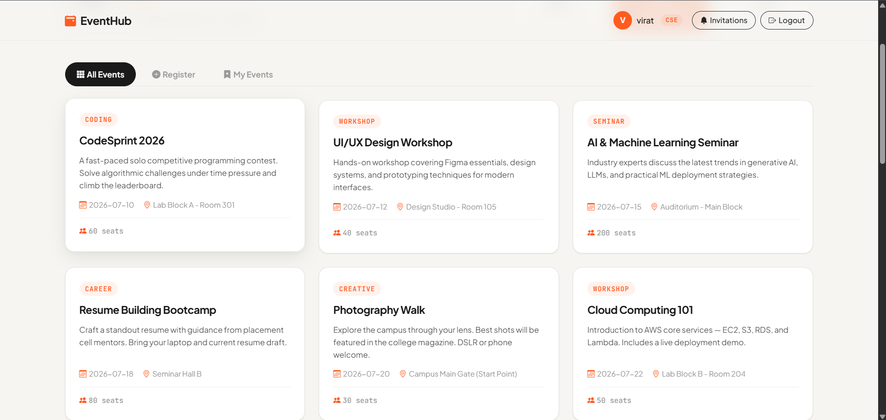

# EventHub - AWS Powered Student Event Registration System

## Features

### User Management
- Student registration and login
- Session-based authentication
- Department-wise user profiles
- Secure student ID verification

### Event Management
- Browse upcoming events
- Register for individual events
- Cancel registrations
- Dashboard showing registered events

### Intelligent Team Formation
- Team creation
- Live student search
- Invitation management
- Automatic invitation expiry
- Team capacity validation
- Automatic registration

# ☁️ AWS Cloud Architecture


## ☁️ AWS Services Used

| AWS Service | Purpose in the Project |
|-------------|------------------------|
| Amazon VPC | Created an isolated virtual network to securely host the EventHub application and AWS resources. |
| Public Subnets | Hosted internet-facing resources such as the Application Load Balancer and EC2 instances. |
| Private Subnets | Securely hosted the Amazon RDS database, preventing direct internet access. |
| Internet Gateway (IGW) | Enabled internet connectivity for resources deployed in the public subnets. |
| NAT Gateway | Allowed resources in private subnets to access the internet for updates without exposing them to inbound traffic. |
| Route Tables | Controlled network traffic between public/private subnets, the Internet Gateway, and the NAT Gateway. |
| Security Groups | Configured firewall rules to control inbound and outbound traffic for the EC2 instance, Application Load Balancer, and Amazon RDS. |
| Amazon EC2 | Hosted the Flask-based EventHub web application and handled client requests. |
| Amazon S3 | Stored uploaded student identity documents and application assets securely in the cloud. |
| Amazon RDS (MySQL) | Stored application data including users, events, registrations, invitations, and team information. |
| IAM | Managed user permissions, roles, and secure access to AWS resources and services. |
| Application Load Balancer (ALB) | Distributed incoming HTTP requests across the application instances to improve availability and reliability. |

## 🏗️ AWS Infrastructure

The EventHub application is deployed within a custom AWS Virtual Private Cloud (VPC), following a secure and scalable multi-tier architecture. The infrastructure consists of:

- Custom Amazon VPC
- Two Public Subnets
- Two Private Subnets
- Internet Gateway (IGW)
- NAT Gateway
- Application Load Balancer (ALB)
- Amazon EC2 Instance
- Amazon RDS (MySQL)
- Amazon S3 Bucket
- IAM Role
- Security Groups

---

## 🚀 Deployment Workflow

1. Created a custom Amazon VPC.
2. Configured:
   - Two Public Subnets
   - Two Private Subnets
3. Configured Route Tables and associated each subnet.
4. Attached an Internet Gateway (IGW) to the VPC.
5. Configured a NAT Gateway for outbound internet access from private subnets.
6. Created Security Groups for:
   - Application Load Balancer
   - EC2 Instance
   - Amazon RDS
7. Created an IAM Role allowing EC2 to securely access Amazon S3.
8. Created an Amazon S3 bucket for storing uploaded student identity documents.
9. Created an Amazon RDS MySQL database inside the private subnet.
10. Launched an EC2 instance.
11. Cloned the Flask application from GitHub onto the EC2 instance.
12. Configured the application with:
    - RDS Endpoint
    - Database Username
    - Database Password
    - S3 Bucket Name
13. Created an Application Load Balancer.
14. Created a Target Group.
15. Registered the EC2 instance with the Target Group.
16. Accessed the application using the Load Balancer DNS.

---

## 🔄 Application Request Flow

```text
                Student
                    │
                    ▼
      Application Load Balancer
                    │
                    ▼
              Amazon EC2
              (Flask App)
              ┌──────────────┐
              │              │
              ▼              ▼
       Amazon RDS        Amazon S3
      (MySQL Database) (Student Documents)
```

---

## 🗄️ Database Design

| Table | Description |
|--------|-------------|
| users | Stores student account information |
| events | Stores event details and metadata |
| registrations | Stores completed event registrations |
| teams | Stores team information for group events |
| team_members | Tracks invitation and team membership status |
| invite_cooldowns | Prevents invitation spam using cooldown timers |

---

## 👥 Team Registration Workflow

One of the key features of EventHub is its intelligent team formation system. The workflow includes:

- Team creation
- Live student search
- Invitation management
- Automatic invitation expiration (180 seconds)
- Invitation cooldown (120 seconds)
- Team capacity validation
- Atomic team confirmation
- Automatic registration of accepted members

This workflow prevents duplicate registrations, incomplete teams, and invitation spam while ensuring data consistency.

---

## 💻 Technology Stack

### Backend
- Python
- Flask

### Database
- Amazon RDS (MySQL)

### AWS Cloud Services
- Amazon EC2
- Amazon RDS
- Amazon S3
- Application Load Balancer
- Amazon VPC
- IAM
- Internet Gateway
- NAT Gateway
- Security Groups

### Libraries
- Flask
- boto3
- PyMySQL

---

## 📸 Project Screenshots

### 🔐 User Login


Secure login page where students authenticate using their registered email address and password.

---

### 📝 User Registration


Students can create an account by entering their personal details and uploading a valid student ID for verification.

---

### 🏠 Dashboard


The dashboard displays an overview of available events, registered events, and remaining seats for the logged-in student.

---

### 📅 Browse Events


Students can browse all upcoming campus events, including event category, date, venue, and available seats.

---

### 🎟️ Event Registration


Students can select an event and register individually or initiate team registration for group events.

---

### 👥 My Events


Displays all events the student has successfully registered for, with options to manage registrations before deadlines.

---

## ☁️ AWS Deployment Screenshots

### 🏗️ VPC Configuration


Custom Amazon VPC configured with a CIDR block of **10.0.0.0/16** to provide a secure and isolated network for the EventHub application.

---

### 🗺️ VPC Resource Map


Shows the complete VPC architecture including public/private subnets, route tables, Internet Gateway, and NAT Gateway.

---

### 🌐 Subnet Configuration


Two public and two private subnets deployed across multiple Availability Zones to improve availability and security.

---

### 🚪 Internet Gateway & Route Tables


Configured routing rules to provide internet access to public subnets through the Internet Gateway while maintaining secure routing for private resources.

---

### 🔄 NAT Gateway


Allows instances within private subnets to securely access the internet for software updates without exposing them to inbound traffic.

---

### 🖥️ EC2 Instance


Amazon EC2 instance hosting the Flask-based EventHub web application.

---

### 💻 SSH Access


Successful SSH connection to the EC2 instance used for deployment, configuration, and application management.

---

### ⚖️ Application Load Balancer


Application Load Balancer distributes incoming HTTP requests and improves application availability and scalability.

---

### 🗄️ Amazon RDS (MySQL)


Amazon RDS MySQL database deployed within private subnets to securely store application data including users, events, teams, and registrations.

---

### 📦 Amazon S3 Bucket


Amazon S3 bucket used to securely store uploaded student identity documents and other application assets.

---

### 🔒 Security Groups


Security Groups configured to control inbound and outbound traffic between the Load Balancer, EC2 instance, and Amazon RDS database.
## 📂 Project Structure

```text
EventHub/
├── app.py
├── templates/
├── static/
├── requirements.txt
├── README.md
└── screenshots/
    ├── frontend/
    ├── backend/
    └── architecture/
```

---

## 🔮 Future Improvements

- Implement password hashing using bcrypt.
- Enable HTTPS using AWS Certificate Manager (ACM).
- Add Auto Scaling Groups for improved scalability.
- Deploy EC2 instances across multiple Availability Zones.
- Implement CI/CD using GitHub Actions.
- Containerize the application using Docker.
- Integrate Amazon CloudWatch for monitoring and logging.

---

## 👨‍💻 Author

**Vasudev A**  
AWS Cloud Computing Internship Project – ICT Academy & AWS Academy
